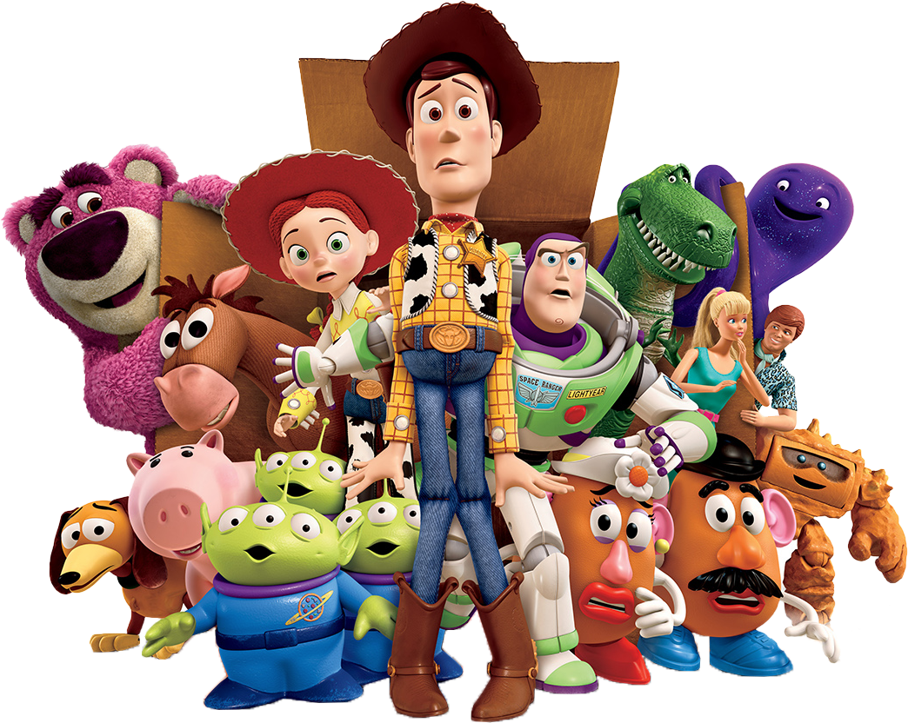

# Tic-Tac-Toe-GAME

## Technical Requirements
* Render a game board in the browser
* Switch turns between X and O
* Visually display which side won if a player gets three in a row, or show a draw if neither player wins
* Include separate HTML / CSS / JavaScript files
* Stick with KISS (Keep It Simple Stupid) and DRY (Don’t Repeat Yoursel
* Use JavaScript and/or jQuery for DOM manipulation
* Deploy the game online
* Use semantic markup for HTML and CSS
* well-formatted, and well-commented code

## Technologies
* HTML
* CSS
* JavaScript
* jQuery

## User Stories
* The user able to start a new tic tac toe game
* The user able to add his name (optional)
* Thr user able to click on a square to add X first and then O, and so on
* The user shown a message after each turn for if I win, lose, tie or who’s turn it is next
* The user not be able to click the same square twice
* The user shown a message when I win, lose or tie
* The user not be able to continue playing once I win, lose, or tie
* The user able to play the game again without refreshing the page (using reset button )